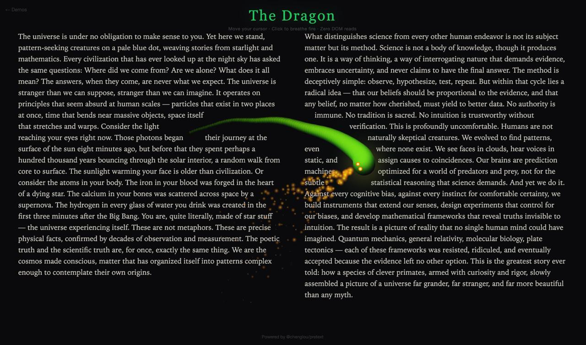

# PreText Experiments

Experimental demos built on top of [@chenglou/pretext](https://github.com/chenglou/pretext) — a pure JS/TS library for multiline text measurement & layout without DOM access.

Pretext measures text via Canvas and lays it out with pure arithmetic at 60fps. No `getBoundingClientRect`, no `offsetHeight`, zero DOM reflow in the hot path. These demos explore what that unlocks.



## Demos

### Dragon

An 80-segment dragon follows your cursor and parts text like water. Click to breathe fire.

- Physics-based segment chasing (each segment trails the previous at fixed distance)
- Circle-to-band collision for per-line text exclusion
- Two-column layout with `layoutNextLine()`, intervals carved around the dragon body
- Fire breath particle system on canvas overlay

Based on the [aiia.ro dragon demo](https://aiia.ro/pretext/).

### Anime Walk

An anime character walks a figure-8 path across a magazine-style two-column spread. Text reflows around her in real-time.

- Inline SVG character (no external assets)
- Rectangle-based obstacle with padding for text exclusion
- Continuous two-column text flow with automatic column overflow
- Light/paper editorial theme with column rules and serif typography

Inspired by videos of anime characters walking across webpages with live text reflow.

### Included Upstream Demos

- **Accordion** — collapsible sections with pre-measured heights
- **Bubbles** — tight multiline message bubbles via shrinkwrap binary search
- **Dynamic Layout** — editorial spread with obstacle-aware title routing
- **Editorial Engine** — animated orbs, pull quotes, multi-column flow
- **Rich Text** — inline text, code spans, links, and chips
- **Masonry** — text-card grid with height prediction
- **Variable Typographic ASCII** — particle-driven proportional ASCII art

## Setup

```sh
bun install
bun start
```

Open http://127.0.0.1:3000/demos (no trailing slash).

## How Text Reflow Works

The key API is `layoutNextLine()` — it lays out one line of text at a time with a variable width:

```ts
import { prepareWithSegments, layoutNextLine } from '@chenglou/pretext'

const prepared = prepareWithSegments(text, '18px Georgia')
let cursor = { segmentIndex: 0, graphemeIndex: 0 }
let y = 0

while (true) {
  // Width changes per line based on obstacles at this y-band
  const width = getAvailableWidth(y, y + lineHeight, obstacles)
  const line = layoutNextLine(prepared, cursor, width)
  if (!line) break
  renderLine(line.text, x, y)
  cursor = line.end
  y += lineHeight
}
```

For each line, you query which obstacles intersect that line's vertical band, carve out blocked intervals, and feed the remaining width to `layoutNextLine()`. The library handles all the text breaking, shaping, and measurement — you just control the geometry.

## Credits

- [Cheng Lou](https://github.com/chenglou) — pretext library
- [aiia.ro](https://aiia.ro/pretext/) — dragon demo concept
- [Sebastian Markbage](https://github.com/chenglou/text-layout) — original text-layout seed
